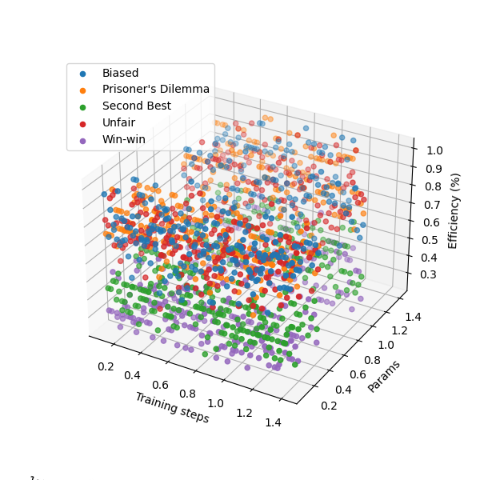

# Scaling laws in language models

This is a toy project trying to derive scaling laws for cooperative behaviour in language models, adapting the setup from [Playing repeated games with Large Language Models](https://arxiv.org/abs/2305.16867) and using [Pythia pretrained models](https://github.com/EleutherAI/pythia) to evaluate changes in behaviour at different parameter counts and training lengths.

This was inspired by [this idea](https://aisafetyideas.com/?idea=293) by Gabe Mukobi.